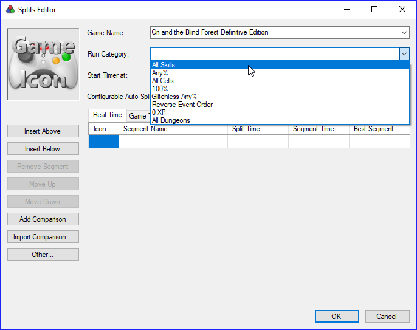

============
Autosplitter
============

The autosplitter is a LiveSplit tool which splits when a condition based on a
game event is filled. The latest versions of LiveSplit embed an autosplitter
for **Ori and the Blind Forest** created by **DevilSquirrel**.

-------------------------
Enabling the autosplitter
-------------------------

To enable the autosplitter, you first need to set the game and the category
you're running and LiveSplit will detect if there is an autosplitter available
for it. Here we want to set

* Game Name: Ori and the Blind Forest Definitive Edition
* Run Category: All Skills

To do so, go to :guilabel:`Edit Splits...`

.. note::

  If you're running a subcategory (No OOB/TA is a sub category of All Skills
  alongside No Restrictions), you may also need to set it in the
  :guilabel:`Additional Info` tab. Here you want to set the All Skills sub
  category ``No OOB/TA``.

  .. image:: _figures/livesplit-subcategory.png
     :width: 45%
     :align: center

Now you should see that a configurable autosplitter is available for this game.
You should now be able to :guilabel:`Activate` it.

.. figure:: _figures/livesplit-autosplitter-disabled.png

  Activate the autosplitter

----------------------------
Configuring the autosplitter
----------------------------

In order to configure the autosplitter, :guilabel:`Settings` button next to the
:guilabel:`Activate` one. You should have something like this:

.. figure:: _figures/default-autosplitter-settings.png

  Default autosplitter settings

For now there are only 2 autosplits set, ``Start Game`` and ``End Game`` which
will respectively start the timer when you chose the difficulty and stop it when
you lose the control of Naru at the end of the run.

.. image:: _figures/prologue-skip.gif
   :width: 45%

.. image:: _figures/time.gif
   :width: 45%

You are basically good to go. Nevertheless you might want to add some splits in
the middle of the run to track your progress, see where you lose time from one
run to another and compute what we call a **Sum of Bests**.

-------------------------
Combination of autosplits
-------------------------

Some events might be hard to transcribe into an autosplit. In fact, if the
event you want to catch is a bit complex (e.g: Save & Quit, Entering Horu after
collecting 10 Ability Cells), a unique autosplit is not enough. However, it is
possible to stack them to make LiveSplit split when all the conditions are
filled. The checkboxes on the right of each autosplit is what makes it
possible.

* If the checkbox is checked off: LiveSplit will split when the condition is
  filled.

* If the checkbox is not checked off: LiveSplit will check the condition without
  splitting but will add this requirement to the next split that has its
  checkbox checked off

As an example, this is the sequence of autosplits required to

.. todo: Add a screenshot of the autosplit of the Save & Quit and the gif
